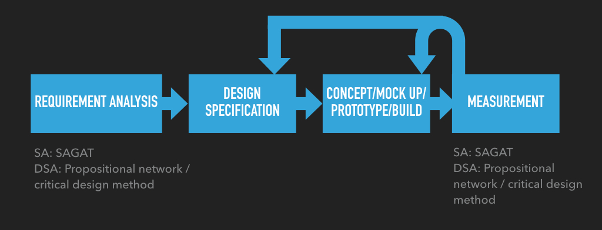

Designing to Support (Distributed) Situation Awareness

Both Situation Awareness and Distributed Situation Awareness are interesting concepts to consider when designing complex systems. Both have their own design methods, processes and measurement methods, which should help system designers to support high SA on end users. But the real question is, how do you use these models to improve design?

I’ve written about SA and DSA before:

[Situation Awareness](../sa/situation-awareness.md)
Endsley’s three level individual level SA model

[Distributed Situation Awareness](../dsa/distributed-situation-awareness.md)
Stanton et al. system level DSA model

Endsley, Bolte and Jones have published a book named Designing for situation awareness: An approach to human-centered design on SA-oriented design (Endsley et al 2003). Salmon, Stanton, Walker and Jenkins have published their view on DSA-oriented design in a book Distributed Situation Awareness: Theory, Measurement and Application to Teamwork (Stanton et al 2009).

Both of these are briefly covered here. The figure below is a top level description combining both approaches: analysis-specification-build-measure-repeat -cycles.

## SA-Oriented Design

Endsley, Bolet and Jones divide SA-oriented design process to three main stages: requirements analysis, SA-oriented design principles and SA measurement. SA requirements analysis consists of goal directed task analysis (GDTA) . GDTA is interested in goals of the task, decisions the operator must make to achieve goals and information that is needed to make those decisions. Focus is on so called dynamic information requirements, which means information that changes dynamically during the task, opposed to general system knowledge. GDTA is conducted by interviewing experienced operators and by combining this data with knowledge from other sources, like written materials, documentation, protocols etc.. The GDTA results are then validated by large number of experienced operators.

There are also a number of design principles for SA oriented design listed in the book. Examples of these are “Organise information around goals”, “Present Level 2 information directly” and “Provide assistance for Level 3 SA projections”. Most of the principles concern GDTA results or are general recommendations relating to three level model of SA.

Design principles and GDTA results do not automatically lead to design solutions, which is why designs need to be objectively measured. There are many direct and indirect ways of measuring SA, but direct and objective measurements in conjunction with workload and performance evaluation is the most thorough approach. Situation awareness global assessment technique (SAGAT) is one often used method to measure SA. SAGAT requires the task under analysis to be halted at random periods and batteries of questions to be presented at operators. Answers are then evaluated by subject matter experts.

Whichever the SA measurement method is, the important part is to feed results back to design to improve solutions until SA requirements are satisfied.

## DSA-Oriented Design

DSA design process is quite similar to SA-oriented design process, but the tools and focus are different. DSA is also interested in the tasks operators are performing, but the method to analyze them is hierarchical task analysis (HTA), which uses data from observations, documentation, interviews with subject matter experts, training materials, etc.. HTA is used to identify the SA requirements, which should be further refined to build a propositional network describing the relations between information elements. Information elements will be further categorized (by using HTA, propositional network and subject matter experts) to compatible and transactive elements – meaning information that is used in different ways by different operators, and information that is passed between operators.

Results of the SA requirements analysis is used to create a design specification describing what information, to whom, in what format, for which need should be presented. Specification should link end user tasks to information elements to be presented, as well as what other information elements are likely to be used in conjunction. There are also 18 design guidelines that can be used to guide the design process (Salmon et al 2009, 218-223).

Finally, mock ups should be built based on the design specification, to test how well they support DSA. The nature of testing depends on what is to be tested – mock ups can be tested using a propositional network method, but operators use of prototypes can also be analyzed using critical decision method interviews. Findings from the test should be fed back to the design phase.

## Summary

Top level image at the beginning shows that SA- or DSA-oriented design processes both are based on a basic design-build-measure-repeat -cycle. The real value is in methods that are used to gather and describe requirements, and how SA or DSA is measured. It is important to note that prototyping is encouraged to avoid spending time implementing systems that are not going to fulfill the requirements – SA and DSA can (to some point) be measured using prototypes as well.

Concentrating on the tasks and information elements seems to be the key in designing to support situation awareness, no matter if you consider it on the individual or systems level. It would be interesting to analyse these more deeply to see how the results of these processes differ and does it show somehow in the final designs.

These design methods are also quite heavy and demand time, resources and skills. On the other hand, they are also to be used in situations which require special consideration on performance, security and so on.

## References

Endsley, M. R., Bolte, B., & Jones, D. G. (2003). Designing for situation awareness: An approach to human-centered design. London, UK: Taylor & Francis.

Salmon, P.M., N.A. Stanton, G.H. Walker, and D.P. Jenkins. 2009. Distributed Situation Awareness: Theory, Measurement and Application to Teamwork. Ashgate: Aldershot.