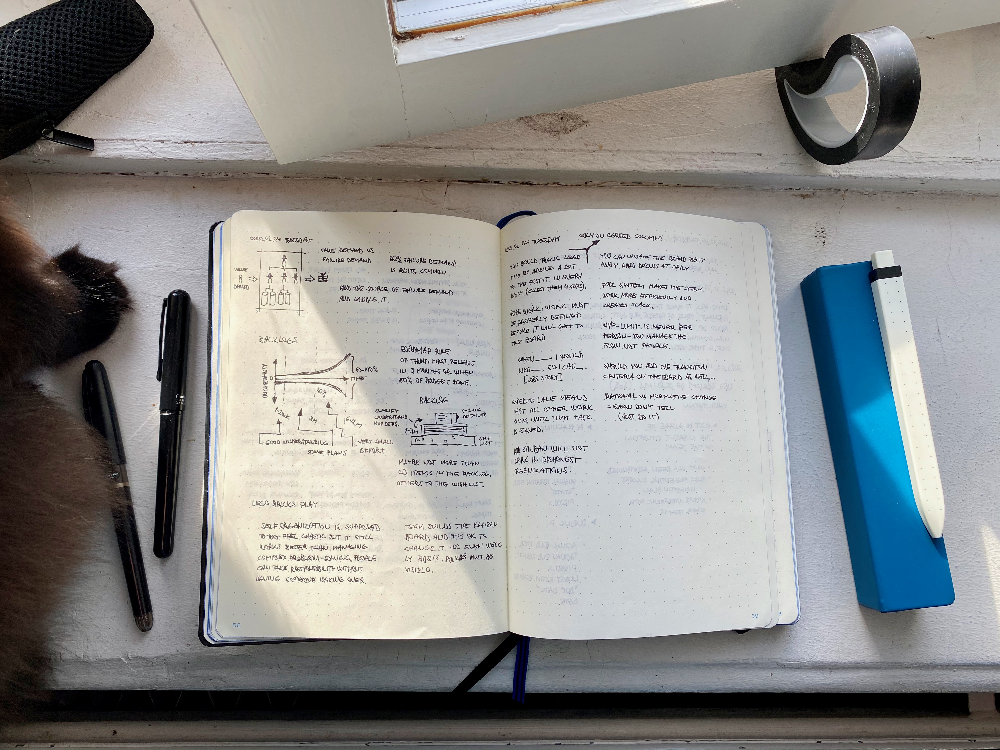
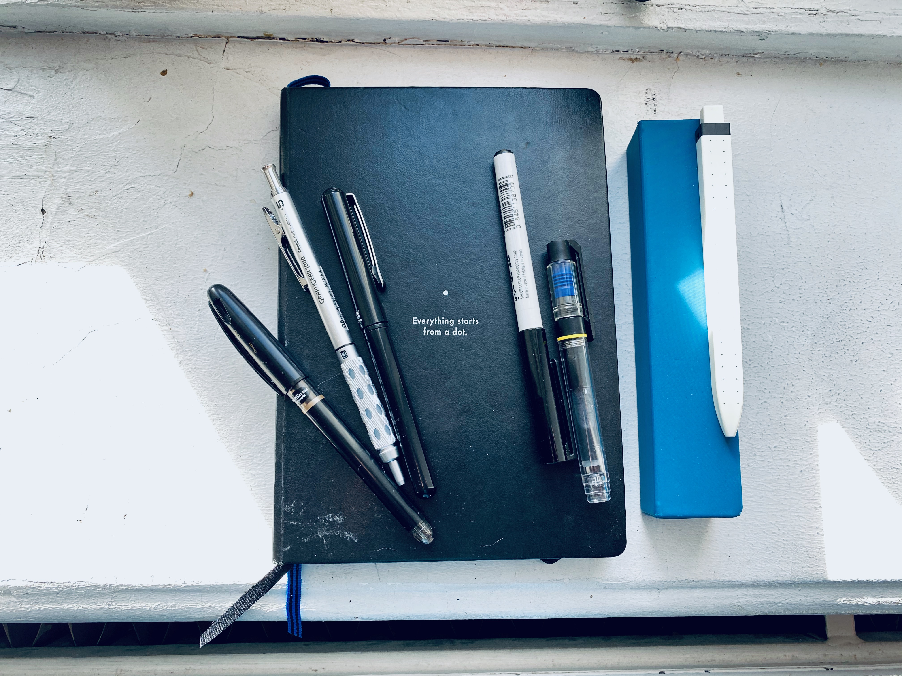
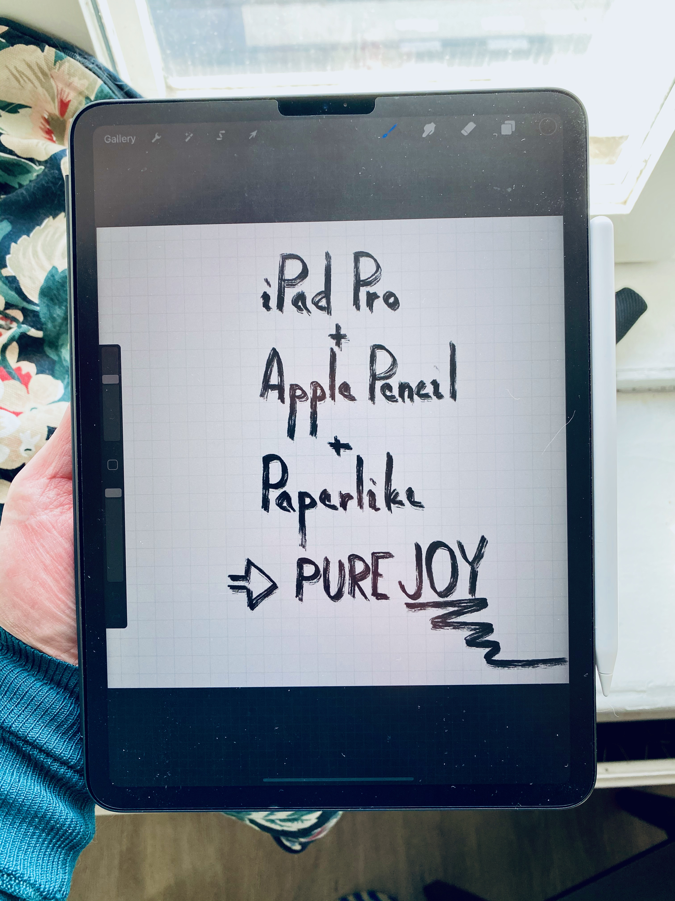

I like taking handwritten notes - you can almost always bring your notebook with you, and it doesn't feel as disrespectful to not down some words by hand compared to using computer for the same task.

Sometimes it isn't practical to use physical notebook, so I also have an iPad Pro with Apple Pencil for digital notetaking. iPad is exceptionally well suited for reading and marking books if they are in PDF format.

## Physical Notetaking
My go-to notebook is Leuchtturm1917 with dotted pages. The paper is of good quality, dots are right on spot and the pages have a bit yellowish color to them. For example Noona notebooks are too white and the dots are too close to each other. 

Currently my favorite pen is Pentel Tradio 05. I like using rollerball pens because they are so smooth but also leave a solid mark.
## Digital Notetaking
I went through a lot of devices when I was looking for the perfect match for digital notetaking with a pen. Of course, there is no perfect way to do it, but the closest I could find is iPad Pro with Apple Pencil.

Cheap? No. Satisfying? Very.

I have three kinds of digital notetaking needs:

* Reading and annotating PDF files
* Notetaking
* Sketchnoting

Reading and annotating PDF files, <strong>[Notability](https://www.gingerlabs.com/)</strong> has been nerly pefect for this task. You can add PDF files to it and it converts them to notes, which you can read and annotate. It remembers where you are reading and annotating is effortless - you can highlight or add underlines and write on the margins. Exporting to PDF is a possibility as well, so you are not completely locked down to the app.

Plain old <strong>notetaking</strong> is a bit trickier to tackle. Notability of course is a good option for notetaking too, but its organizational features are limited: you can create "folders" and put them into stacks, but that's it. No tags, no nested folders. 

<strong>[GoodNotes](https://www.goodnotes.com/)</strong> has more features in this sense, but to me its UI feels a bit too crowded and I haven't used it that much. 

I'm been using [Bear](https://bear.app/) a bit for keeping typed notes, and it also has very limited capability for hand written notes, but it definitely is not meant to be used that way. Bear is beautiful and simple, so if you need typed notes, it's an excellent option. Built in [Markdown](https://en.wikipedia.org/wiki/Markdown) support and a tagging system.

<blockquote>...nothing in the world of digital notetaking beats the feel of Procreate on iPad with Apple Pencil</blockquote>

[Procreate](https://procreate.art/) is an awesome piece of software for art and a really good candidate for <strong>sketchnoting</strong> as well. It has a good selection of calligraphy pens and writing and drawing always feels a pleasure. As a painting software it doesn't support multiple pages, unless you count the layers, so recommending it for notetaking is a bit risky. Still, nothing in the world of digital notetaking beats the feel of Procreate on iPad with Apple Pencil. I try to move towards sketchnoting and Procreate has been excellent for that.

I like taking handwritten notes - you can almost always bring your notebook with you, and
it doesn't feel as disrespectful to not down some words by hand compared to using computer for the same task.

Sometimes it isn't practical to use physical notebook, so I also have an iPad Pro with Apple Pencil for digital notetaking. iPad is exceptionally well suited for reading and marking books if they are in PDF format.

## Physical Notetaking

My go-to notebook is Leuchtturm1917 with dotted pages. The paper is of good quality, dots are right on spot and the pages have a bit yellowish color to them. For example Noona notebooks are too white and the dots are too close to each other. 

Currently my favorite pen is Pentel Tradio 05. I like using rollerball pens because they are so smooth but also leave a solid mark.

## Digital Notetaking

I went through a lot of devices when I was looking for the perfect match for digital notetaking with a pen. Of course, there is no perfect way to do it, but the closest I could find is iPad Pro with Apple Pencil.

Cheap? No. Satisfying? Very.

I have three kinds of digital notetaking needs:
* Reading and annotating PDF files
* Notetaking
* Sketchnoting

Reading and annotating PDF files, <strong><a href="https://www.gingerlabs.com/">Notability</a></strong> has been nerly pefect for this task. You can add PDF files to it and it converts them to notes, which you can read and annotate. It remembers where you are reading and annotating is effortless - you can highlight or add underlines and write on the margins. Exporting to PDF is a possibility as well, so you are not completely locked down to the app.

Plain old <strong>notetaking</strong> is a bit trickier to tackle. Notability of course is a good option for notetaking too, but its organizational features are limited: you can create "folders" and put them into stacks, but that's it. No tags, no nested folders. 

<strong><a href="https://www.goodnotes.com/">GoodNotes</a></strong> has more features in this sense, but to me its UI feels a bit too crowded and I haven't used it that much. 

I'm been using <a href="https://bear.app/">Bear</a> a bit for keeping typed notes, and it also has very limited capability for hand written notes, but it definitely is not meant to be used that way. Bear is beautiful and simple, so if you need typed notes, it's an excellent option. Built in <a href="https://en.wikipedia.org/wiki/Markdown">Markdown</a> support and a tagging system.
<blockquote>...nothing in the world of digital notetaking beats the feel of Procreate on iPad with Apple Pencil</blockquote>

[Procreate](https://procreate.art/") is an awesome piece of software for art and a really good candidate for <strong>sketchnoting</strong> as well. It has a good selection of calligraphy pens and writing and drawing always feels a pleasure. As a painting software it doesn't support multiple pages, unless you count the layers, so recommending it for notetaking is a bit risky. Still, nothing in the world of digital notetaking beats the feel of Procreate on iPad with Apple Pencil. I try to move towards sketchnoting and Procreate has been excellent for that.
