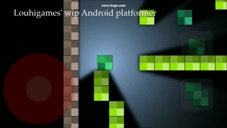
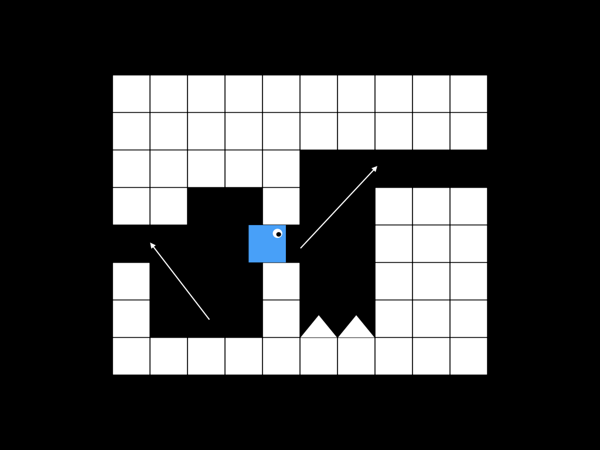
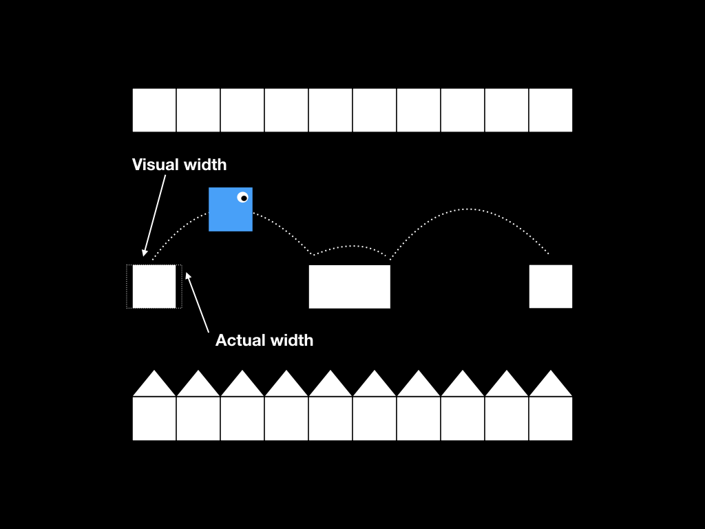

Few days ago I started to think that yes, actually I have some experience on developing a platform game, and there were quite a many surprisingly important things to consider when designing the platform game experience. Ultimately it means keeping a balance between simulation and a game that feels fun.

Interactions in games are fascinating because usually people have a gut feeling of when the game feels right, but it’s not an easy task to replicate the experience. Controls and how the character follows players interactions are vital in platform games – winning or losing can be determined by milliseconds of differences in the timing of button presses. The game mechanics and difficulty should match the gamers understanding of a fair and challenging game.

[Platformer Prototype from 2013](https://youtu.be/0MV0MXj0Y8s)
At this point I had already started porting the game to Android, which made it much more slow

The platform game I was working on was a 2D one with procedurally generated maps. We never finished it – life got on the way. World consisted of equally sized squares that formed the caves and obstacles. For some reason I decided to make character to be equally sized square. The idea was that the maps would be procedurally generated and somehow “endless”, and that the player could build new blocks and destroy old ones. Minecraft style.

The gif is from the Android version, but originally I designed the game to be played using a keyboard. Physical keys enable much more precise controls than the touch screen and I enjoyed optimising the user experience of the game.

## The elements of UX in platform game
Areas I found important in a UX of a platform game are

- Hero physics
- Interactions between hero and world
- Balance between fair and unfair challenge

## Hero physics

Physics of a platform game are interesting. I had used Box2d before and at first thought that realistic physics would be fun. The weren’t. Game character that follows realistic physics, especially in a 2D game tend not to be that fun. At least I want the controlled character to follow controls snappily, and Newtonian physics makes it too hover-like.

I made custom “physics” that made the character to feel more responsive – jumps started snappily and were unrealistically high. Leaning to a wall during the jump slowed down the falling, and you were also able to jump again from the wall (just once per overall jump). You were able to change direction mid air to some extend, and to end jump early by pressing down.

## Interactions between hero and world

How the hero interacts with the world is of course part of the physics too, but now I mean those tricky corner cases that you need to consider when designing the physics of a game.

Maps were procedurally generated so the paths that the player had to follow were not always optimal. Let’s consider the following image.

Problem with equally sized blocks and paths near the ceiling

The hero is equally sized to map blocks, so there wasn’t additional space for jumps, if the cave was one block high. How do you jump from the situation like in the picture? Naive preconditions for jumping would be

- Hero is standing on top of a level
- Hero is not hitting the ceiling
- Player is pressing the jump button

This would make it impossible to play a spot like in the image above. Fixed preconditions would be

- Hero is standing on top of a level, or has been falling less than 100 ms
- Hero is not hitting the ceiling
- Player is pressing the jump button

100 ms of falling is too short time for the player to notice, and the jump feels natural. It also makes it just a little bit less likely to fall from platforms by accident – last minute jump might save the day.

Another problem in the image is jumping to a gap that is close to the ceiling. It would be impossible to jump perfectly to the gap. Hero always hits the ceiling, which might cause the end of a jump and unexpected death. This was fixed so that if the hero jumped to the gap and collision detection concluded it to be just a bit below the level, it would be fixed on the level. This made it just a little bit easier to jump on top of platforms.

## Balance between fair and unfair challenge

Image below represents a classical platform game challenge. Hero has to jump from level to level – death below and ceiling just a little bit too low above. It’s important to be able to control the jump precisely.

Classical platform game challenges

So fine-tunings to fix this scenario are

- Allow hero to jump even though it has been falling for few tens of ms
- Allow player to control the height of a jump
- If the jump falls just a little bit short and hero is still moving towards the level, fix it on top of the level
- Make the hero stop intuitively after the player has stopped pressing move buttons

The player shouldn’t be required to control the hero overly strictly at the right time. Therefore I allowed some slack to the beginning and end of the jump – just enough to make it feel more natural without looking odd. Game physics are not 100% precise anyway, and correctly implemented this kind of fine-tunings make the mechanics feel intuitive without giving the feeling that player has training feel.

Physics also need to determine how long the character moves after the player has stopped pressing “move left” or “move right” buttons. Immediate stop doesn’t feel natural, but too slow stop feels the hero is moving on top of ice. It makes it hard to hit narrow platforms.

## Game, not a simulation

This kind of alleviations in simulation or game mechanics may feel like giving training wheels to the player. That’s not the point. The game doesn’t need to be easy, but it needs to be fair and intuitive. Visuals and controls in a game in combination with abilities of a human player never allow 100% precise controlling. 2D objects in a virtual simulation are able to achieve much more precise movement than humans in real life, so there needs to be some flexibility in the simulation to make game playable and fun.

