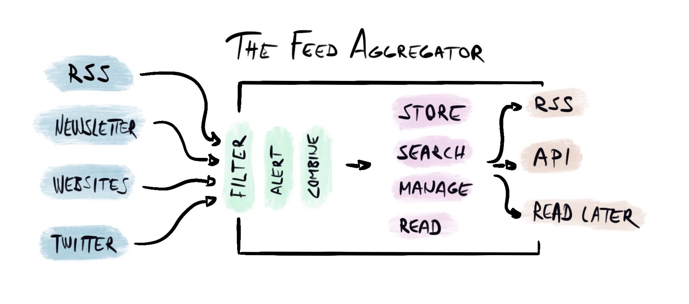

What is the best feed aggregator, reader or feed service depends on your needs, so this is highly opinionated towards my personal needs - yours might vary.

[As I wrote](writings/../rss-and-the-future-or-past-of-web.md), I’ve started using RSS again after some five years break. [Feedly](https://feedly.com/) and [Inoreader](https://www.inoreader.com/) are two services I’ve been comparing now, and I think I will need to be using Inoreader. 

I will explain why, and why I might also return to Feedly.

# What Makes a Feed Aggregator
I noticed that I need to define more precisely what I’m gonna need, to find the best tool(s) for the job as well.

This is what a feed aggregator does, and what features I need.

## Essential Features

> Essential features are the essense of the service: Without them other features don't matter.

It’s all about getting content in in a civilized manner and then consuming that content. Trusting just RSS is not going to be enough, you will also need support for newsletters, websites that don’t provide RSS, and probably Twitter as well. Twitter is not my favorite, but it seems to be important in modern scientific communication.

All that content is going to overwhelm, so you will also need means to filter, create alerts, and combine feeds into buckets. 

Finally, you have the content, so you’d like to store and search it, and just maybe do some reading as well.

## The Differentiators
> The differentiators are essential features, that are missing or implemented exceptionally well. These are the ones that can draw users from competitors, and that you can use to justify higher prices.

Feedly and Inoreader have some differences in the essential features, and a bit surprisingly Inoreader is stronger on this front. Both can handle RSS and Twitter, but only Inoreader can extract [feed from a website that doesn’t provide RSS](https://blog.inoreader.com/2020/04/convert-almost-any-webpage-into-rss-feed-with-inoreaders-web-feeds.html) (if the structure of the website is simple enough) and give you *an email address to be used to subscribe for newsletters*.

Inoreader is also able to **fetch the full article in reading view**, which Feedly is not able to do. Originally I thought it wouldn’t matter that much, but it makes skimming the content faster, even though you’d use another app to read the article. It’s also like using the reading view on the browser.

Finally, Inoreader lets you [create your own feeds](https://blog.inoreader.com/2015/05/inoreader-how-to-share-your-personal.html), which Feedly does not provide. Both give you the API access though, but if the feed is what you need, Inoreader is a much simpler solution.

**Reading view** is important for a service you use to read a lot of content. Both are good enough, but Feedly’s UI is more polished. Inoreader’s native applications are also lacking, but Feedly is also only providing the same web application as wrapped. Still, it’s working better.

## Advanced Features
> Advanced features are something additional on top of essential features. They are not enough without the essentials but may provide a lot of value if everything else is working.

The most interesting advanced feature is **AI**. You’ll get overwhelmed with the amount of content pretty quickly, and AI is one of the most promising ways to ease that burden. This is an advanced feature because it doesn’t do much if you don’t get the content in the first place, and be able to read it. 

That’s lower in the need hierarchy. 

Especially [named entity recognition](https://blog.feedly.com/named-entity-recognition-skill-leo/) would make life so much easier. When I was experimenting with Feedly, I was able to filter out Trump and COVID-19 as named entities, and that’s it. Inoreader does not have AI capabilities, so I’d need to create the rule manually, trying to find the combination of words that match what I mean. 

[Topic detection](https://blog.feedly.com/leo-and-topics/) might be even more important - after all, a lot of articles may mention Trump or COVID-19, but they are not necessarily an important part of the article. I don’t want to avoid seeing those words, I want to avoid the noise that they generate.

Naturally, those features can be used to both filter the content and alert on important topics.

## Need Hierarchy of Feed Aggregators
The importance goes from bottom to top: If you don’t have the things on the bottom, you’ll not care about the things on top.

* AI 
* EXPORT
* STORE, SEARCH
* READ
* FILTER, ALERT, COMBINE
* GETTING THE CONTENT IN

## Features That I Don’t Care About
> Some features are so far from the core of the feed aggregator, that they’d be better off on another platform. There is value in these features, but they might need specialization and specialized services tend to be better.

I’m ready to outsource reading long texts to some **read-it-later service** (like [Instapaper](https://www.instapaper.com/)). It’s still important to be able to read texts in the service itself (to skim if the full text is worth reading) and reading quick ones right away. Some articles are just too long to be read on the spot and it’s valuable to have a tool that remembers where you left off.

I don’t think **social features** are important to me. It’s kind of nice to see if some article is read a lot, but by no means important. I don’t need “likes” or discussion about the topic, because usually, it would only happen with the people that use the same service. It would be good if the service would have a strong, smart, and active user base, but I kind of don’t think it will happen. Why not do the discussion on a platform that is meant for it, like Twitter or Reddit?

**Team or business features** are not important to me and I don’t think I would be sending newsletters either. I can see how team features could be amazing with a research group or with colleagues, but I have never had that extensive need for content monitoring.

**Highlights and notes** are a mystery to me. I keep them elsewhere (and I could see myself using Evernote, Pocket, Instapaper, or even plain old PDF for that. I have a hunch that this might be something I haven’t figured out yet - maybe highlights and comments in a feedreader could be used more as a quick preprocessing step in the process.

# Why Inoreader is Better for Me
Right now Inoreader is better focused on getting the content in (and out) and making it easy to read that content as well. They can generate feeds from websites that don’t provide RSS if the structure of the website is clear enough. It has worked for me every time. It’s ridiculous that nowadays even some blogs don’t provide RSS feeds.

Inoreader can also generate an email address that you can use to follow newsletters, which then pop up to Inoreader as a feed. For example, some academic sources do not allow any kind of RSS or other feeds, and the only option may be email alerts. If you can give the address, you can use the one Inoreader generates for you. Otherwise, you’ll need to create a forward from your email to Inoreader. Tampere University is using Office365 and it was easy to create rules and forwarding.

Inoreader fetches the full article so you can read it in their application. It doesn’t work every time because it is not based on RSS - they need to crawl the target website and parse the content out of it. It has been working almost flawlessly to me.

Pricing is important, and Inoreader is much cheaper. Current Feedly Pro+ price of $140 feels too much, and because managing feeds and setting up the system is a lot of work, it starts to feel like a vendor lock. Moving out is a big effort, but staying costs a bit too much - it generates cognitive dissonance. I understand that NLP tools are not cheap and cost per users, but I hope they can get the prices a bit lower.

## What I’ll Miss From Feedly 
I was excited about Feedly’s AI offering and it seemed to work at least “OK”. I will probably return to Feedly because of this. 

Feedly is prettier. I like their UI and I’d like to use it. Inoreader website is functional and good enough on desktop, but not on iPad or iPhone, and the apps are not good enough. 

People from Feedly have hinted they are implementing support for generating feeds for non-RSS websites and newsletters. It’ll take some months (as of May 2020), but they should be coming. Feedly’s support has also been helpful so I wouldn’t mind supporting the company.

# If I Could Decide
The optimal solution would of course be a combination of both - focus on getting the content in where ever and in which format it is, and combining NLP and beautiful UI (and native apps) on top of it. If I can’t get all the sources to the one app, I will need to be using multiple apps, or app and emails, or whatever: It takes time and leads me to forget where I saw That One Article. No social features and no notes or highlights beyond tagging and starring.

Nowadays you can demand a beautiful and snappy application, and you should. The application you use to read most of the content on the web should be beautiful and pleasant to read with. Reading view could be themed based on the color theme of the source website, to help differentiate the reading experience and notice what kind of article you are reading

Everything this under $100 a year

Btw, Feedly's and Inoreader's margeting texts support beautifully my valuation of their features. 

> "Take back control of you news feed"

> "Goodbye information overload"

First I need to get back the control of my feed and then I can battle the information overload.

## My Feature List For Feeds Aggregator

This is the feature list I use to select a feed aggregator.

Getting content
* Following feeds (RSS, JSON feed, whatever)
* Generating a feed from a website that doesn’t provide it
* Using newsletters as feed
* Twitter

Content filtering and alerts
* Text or regexp filtering from title or content
* Text or regexp alerts from title or content

Content processing
* Bookmarking / saving articles

Reading
* Getting the whole article when asked
* Beautiful typography and dark/light mode

Exporting
* Creating an outbound feed
* Exporting all the feeds (to be imported to another service)

Others
* API access is essential for third party readers and making it possible to process content by your means.
* UI and visuals - The older I get, the less willingly I use an application that looks bad.
* Theming the reading view to match the source website