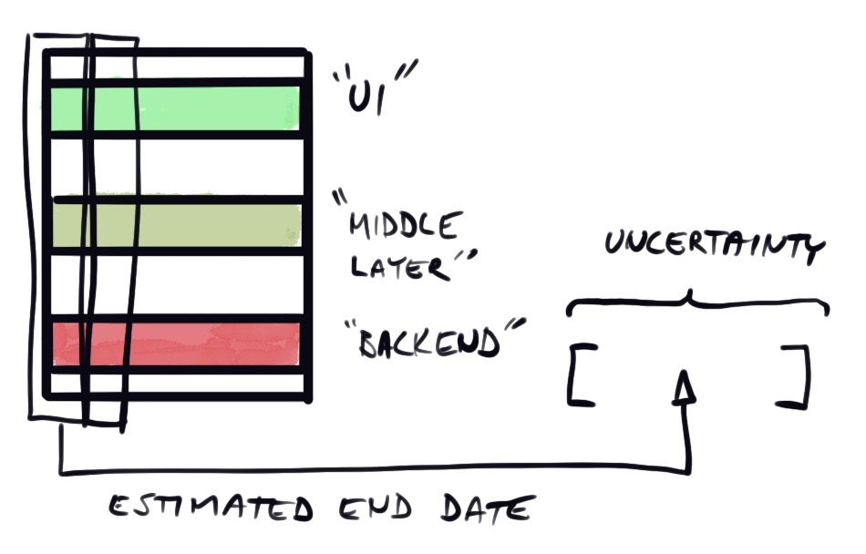
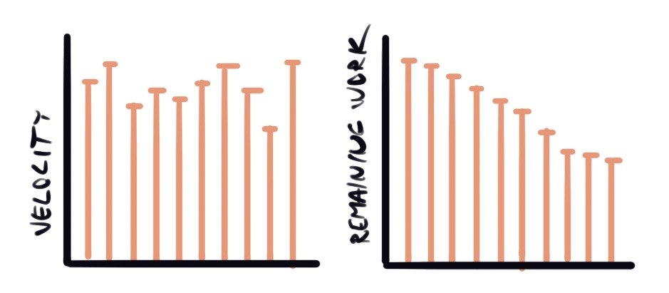

Estimating programming work is hard and communicating uncertainty can be tricky as well, even inside the team.

Scrum.org has a text about [Commitment vs. Forecast:  A Subtle But Important Change to Scrum | Scrum.org](https://www.scrum.org/resources/commitment-vs-forecast). in which they elaborate the matter:

> "In Scrum, the Development Team is now asked to forecast the specific work that can be done in a Sprint, rather than commit to it."

Everyone knows that software is hard to estimate, and asking people to commit to those forecasts sets the wrong tone. The team does its best to forecast what happens during the next iteration (or iterations, if using something like SAFe). The team knows it’s their best guess at the time - forcing them to explicitly state that they are “committed” to it feels almost like abuse of power. If you want to know how confident they are to the forecast, ask how confident they are.

Scrum.org explains the terminology much better than I could:

> “… if we pay attention to the meaning of the words, this would lead us to have a broken commitment versus a non-materialized forecast. When a commitment is broken or not fulfilled, it is usual to expect some sort of accountability, fault, or even compensation. When a forecast doesn’t come true, it is easier to think about matters such as learning from the experience, improvement, and - in one word - empiricism, which at the end is what Scrum is about.” 

Business needs predictable forecasting, but it should come from the proven track record of the work team has already delivered, and from the trust coming from working together. The longer the team works with the same project, the better it becomes in forecasting future. Spending more time on planning and estimation improves the accuracy to some extent, but simultaneously it also creates more waste.

## SAFe would benefit from using the same terminology as Scrum.

As is explained on the [Scaled Agile Framework website about PI objectives](https://www.scaledagileframework.com/pi-objectives/), 
> “A vote of confidence is held near the end of PI planning, where the teams commit to the PI objectives.”

So you are forced to **commit** to the PI Objectives to complete the planning. SAFe tries to make uncertainty more visible by dividing the PI Objectives to “Committed” and “Uncommitted” and by adding that during the PI teams should also “escalate” immediately if they discover that commitments are not achievable, for corrective actions. However, the ask for a commitment at the end of PI planning is still there. 

That adds a huge pressure to those that don’t feel confident in committing to fulfill a forecast. At the end of planning people are already tired and it’s hard to start discussing what “commitment” really means. Canceling the planning sets all the schedules explicitly back and people need to clear their calendars for another planning. 

Ending the intensive planning by asking “is the team committed to the objective” gives a negative connotation to planning work: this is now your commitment and we’ll be holding you to it. Doing that when everybody knows that the result of two days planning for the next eight weeks (in case of SAFe) is just a guess or forecast, is forcing people to promise more than they know they can deliver. 

## Agile is about being responsible and transparent

Being responsible is already built in an agile way of working - when the team accepts tasks, they also accept the responsibility of doing their best to deliver good quality, updating the estimate when needed, and communicating the status of the task ([Clean Agile, pages 60-61](https://www.goodreads.com/book/show/45280021-clean-agile)). 

The trust comes from empiricism - agile produces data on finished end to end slices and that data can be used to predict how long tasks take in the future. 
  

This also emphasises the importance of implementing **end to end slices**: Business needs features for the end users, and from that point of view it's more important to be able to forecast how long an end to end user feature takes to implement. If one team does the backend, another the front, and third takes the whole thing to the production, it's much more complex to 

- understand how long it's going to take
- debug the problems that **will** happen
- handle the whole, including helpful metrics logs

It’s not that easy, nor a silver bullet, but it is a way to get better at forecasting the future of the project. 

The problem of forecast vs commitment might seem like a minor one, but I’ve experienced that wrong wording in this matter can cause negative feelings in the team and cause vain friction between stakeholders. 

The estimation itself is hard, and I don’t think I’ve ever seen it done too well, so it would be good to get all the stakeholders to understand that, and work towards better predictability together.