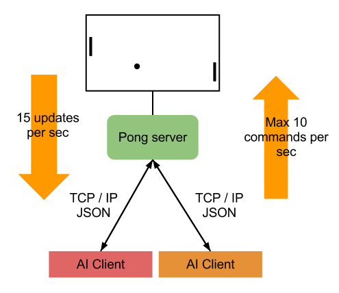
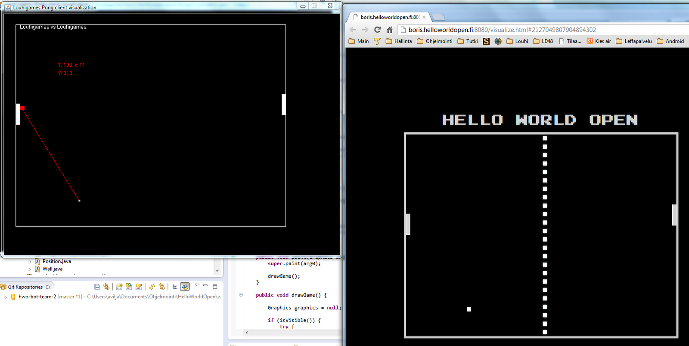
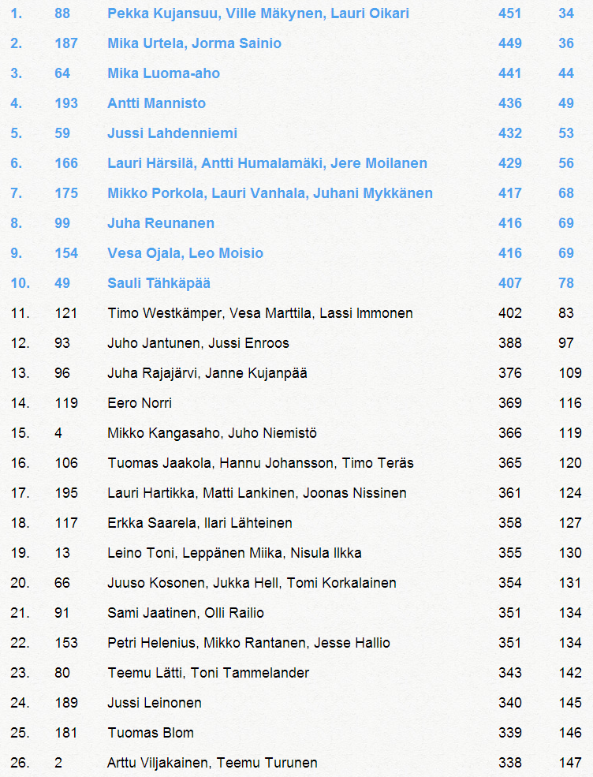

We participated in the first Hello World Open with Louhigames’ crew. Hello World Open is a Finnish coding competition and this was the first year it was organized. 200 teams participated and around 100 of them were able to enter a working program.

We won 338 games and lost 147 and our final ranking was 26. We didn’t have much time to concentrate on this so I must be happy to the final results. I’m satisfied that our bot didn’t crash during the competition and won over 50% of the games it played. We didn’t break any rules and the AI worked as it was meant to.

## Explaining the task

The objective was to create an artificial intelligence client player for a Pong game run on a server. Here is a representation of the system. You can check the details on Github.



In the beginning the server is waiting for players. Client connects to the server using TCP/IP and sens a “join” message. Messages send between clients and server were specific JSON messages. For example, the join message looks like this:
```json
 {“msgType”:”join”,”data”:”name of the bot“}
```
Server confirms the join with “joined” message:
```json
{“msgType”:”joined”,”data”:”http://boris.helloworldopen.fi/visualize.html#game_id”}
```
Then the client waits for the game to begin. After both clients have joined, server begins the game and sends “game started” messages:
```json
{“msgType”:”gameStarted”,”data”:[“left player“, “right player“]}
```
The game ends with the “game over” message.
```json
{“msgType”:”gameIsOver”,”data”:”winner’s name“}
```
During the game server sends 15 update messages per second, telling the positions and sizes of the objects on the game.
```json
{ “msgType”:”gameIsOn”,
“data”: { “time”:1336219278079,
“left”:{“y”:186.0,”playerName”:”left player“},
“right”:{“y”:310.0,”playerName”:”*right player”},
“ball”:{“pos”:{“x”:291.0,”y”:82.0}},
“conf”:{“maxWidth”:640,”maxHeight”:480,”paddleHeight”:50,”paddleWidth”:10,”ballRadius”:5,”tickInterval”:15}}}
```
Note that the game server doesn’t give any information of the

Actual speeds
Accleration
How the ball bounces from the walls
Each client sends commands to the server to move the paddle:
```json
{“msgType”:”changeDir”,”data”:1.0}
```
The value in “change dir” message is a float number from 0.0 to 1.0 representing how fast the paddle should move (again, server doesn’t give more specific information of the speed). Maximum number of commands per second is 10 and if the client sends more, it will be disqualified.

In the finals they also added missiles to the game.

## Our solution

We wanted to use Java because we were most familiar with that. Basically any language able to run on top of JVM was acceptable. Python could have been a very good option to use because it is so fast to use compared to Java.

Our first task was to recreate the Pong game visualization on our client so we could test the client easily. This was a rather simple task, but we did lose some time as we wanted to create our own server for the testing. We managed to made it, but in the end we didn’t have enough time to fully use it to improve our client. We should have concentrated on the client AI itself from the very beginning.

In the screenshot below you can see our local visualization of the game and ball movement predictions on side of “official” game visualization.



After we were able to run and visualize the game and move the paddle, it was time to create the AI itself. First we needed to simulate the ball movement so we could predict where we should move the paddle next. Teemu did very good job with this and we got the simulation work very well. Then it was quite easy to made the paddle move to the expected location.

As the ball bounces differently depending on where it hits on the paddle, we made the AI move so that it would hit the ball with the edge of the paddle. If the angle of the ball was already high enough, we would then hit the ball with a different edge. We didn’t have time to optimize this so we had to rely on that our simple heuristics are enough to beat the enemy.

## Problems

Sometimes we had problems to make the prediction go exactly right which caused our AI to make a small corrective move, which sometimes caused it to miss the ball. In addition we didn’t have time to learn how to make optimal hits to the ball to make it move optimally.

We had quite a lot of problems with Git and Egit during the competition and we lost valuable time solving those. The competition was quite well arranged although I would have hoped them to communicate a bit more. Some rules were not clearly stated. However this was the first time they held the competition. They didn’t expect more than 30 teams to participate and in the end there were 200 teams and almost 100 bots.



I’m quite happy to our rank and the competition itself was a good experience. This was my first proper introduction to Git and JSON.