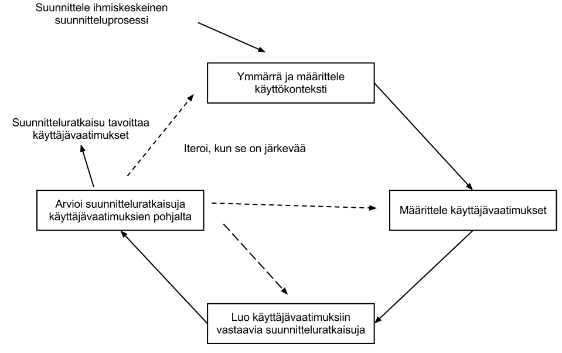

This is in Finnish about ISO 9241-210 (former ISO 13407). You can read about that for example in [Userfocus](http://www.userfocus.co.uk/articles/iso-13407-is-dead.html) or by getting a copy of the standard from [ISO](http://www.iso.org/iso/catalogue_detail.htm?csnumber=52075).

Huomasin gradua tehdessäni, että ISO 13407 onkin vanhentunutta tietoa, sillä nykyisin se tunnetaan nimellä [ISO 9241-210](http://www.iso.org/iso/catalogue_detail.htm?csnumber=52075). Myös sisältö on jonkin verran uudistunut. Tässä on pintapuolinen esittely standardin aktiviteeteista ja periaatteista.

ISO 9241-210 on kansainvälinen standardi, joka tarjoaa opastusta käyttäjäkeskeisen suunnittelun aktiviteetteihin suoritettavaksi interaktiivisen tuotteen elinkaaren aikana. Aiemmin standardi tunnettiin nimellä ISO 13407, mutta vuonna 2010 se sisällytettiin ISO 9241:n [Jok10], joka määrittelee tarkemmin suunnittelun lähestymistapoja [SPR06]. Nimenvaihdoksen lisäksi myös standardin sisältö on muuttunut. Standardi sisältää kuusi ihmiskeskeisen suunnittelun periaatetta ja neljä ihmiskeskeisen suunnittelun aktiviteettia [Jok10, s. 88].

## Malli käyttäjäkeskeiseen suunnitteluun

ISO 9241-210 –standardin malli käyttäjäkeskeiseen suunnitteluun [Jok10]

Kuvasta nähdään, että ISO 9241-210 määrittelee neljä käyttäjäkeskeistä suunnitteluaktiviteettia, jotka ovat järjestelmäkehitysprojektin ytimessä:

1. Käyttökontekstin ymmärtäminen ja määrittäminen
2. Käyttäjävaatimusten määritteleminen
3. Suunnitteluratkaisujen muodostaminen
4. Suunnitteluratkaisujen arvioiminen määrityksiä vasten

Aiempaan standardiin verrattuna aktiviteetit ovat lähes samannimiset, eikä myöskään prosessimallin kaavio ole juuri muuttunut, mutta aktiviteettien kuvauksia on kuitenkin päivitetty [Jok10, s. 90].

## Käyttäjäkeskeisen suunnittelun perusperiaatteet

Aktiviteettien lisäksi standardi määrittelee kuusi käyttäjäkeskeisen suunnittelun perusperiaatetta [Jok10, s. 88]:

1. Suunnittelu perustuu käyttäjien, työtehtävien ja ympäristöjen eksplisiittiselle ymmärtämiselle. 
2. Käyttäjät osallistuvat suunnitteluun ja kehitykseen koko prosessin elinkaaren ajan.
3. Suunnittelua ajaa ja jalostaa käyttäjäkeskeinen arviointi.
4. Prosessi on iteratiivinen.
5. Suunnittelu kattaa koko käyttäjäkokemuksen.
6. Kehitysryhmä sisältää monialaista tietoa ja näkökulmia.

Prosessia tulisi suorittaa iteratiivisesti aina projektin alusta sen loppuun saakka [SRP06]. Uudistetussa standardissa iteratiivisuudesta sanotaan, että kaikkein parasta suunnitteluratkaisua ei tyypillisesti saavuteta ilman iteratiivisuutta [Jok10, s. 89]. Tämän mukaan iteratiivisuutta ei siis sinänsä tulisi tavoitella, mutta siihen tulisi varautua. En ole (lukemani kirjallisuuden perusteella) aivan samaa mieltä iteratiivisuuden “väheksymisestä”, sillä näkisin sen olevan oleellinen osa kehitystä projektista riippuen.  

Elinkaarimallia tulisi edeltää suunnitteluvaihe, jossa määritellään [SRP06]: 

1. Suunnitteluaktiviteetit ja kuinka ne integroidaan muihin järjestelmäke-hityksen aktiviteetteihin
2. Kuka on vastuussa näistä suunnitteluaktiviteeteista
3. Kuinka palautteen kerääminen ja kommunikaatio toteutetaan ja doku-mentoidaan
4. Virstanpylväät ja aikaskaalat, jotka mahdollistavat palautteen sisällyt-tämisen projektiaikatauluun
5. Suunnitteluvaihetta ei tulisi unohtaa, sillä se luo pohjan koko loppumallin hyödyntämiselle.

Standardia ei tietenkään tulisi nähdä valmiina prosessimallina, jota hyödynnetään suoraan. Jokainen malli tulee aina sovittaa kulloiseenkin projektiin. ISO 9241-210 tarjoaa käyttökelpoisia periaatteita ja aktiviteetteja käyttäjäkeskeisen suunnittelun toteuttamiseen. Tässä standardia on käyty läpi hyvin pintapuolisesti ja kiinnostuneiden kannattaakin joko hankkia standardi käsiinsä, tai mieluiten kirja, joka sitä käsittelee. Standardi on myös suomennettu.

## Lähteet

[Jok10] Jokela T.: Navigoi oikein käytettävyyden vesillä, Opas käytettävyysohjattuun vuorovaikutussuunnitteluun. Väylä-Yhtiöt Oy, sähköinen versio, 2010.   [SRP06] 

Sharp H., Rogers Y., Preece J.: Interaction Design: Beyond human-computer interaction. John Wiley & Sons Ltd, Hoboken, NJ 2009.   

Standardin voi hankkia ISOlta: Englanniksi: http://www.iso.org/iso/catalogue_detail.htm?csnumber=52075 Suomeksi: http://sales.sfs.fi/sfs/servlets/ProductServlet?action=showquicksearch&keywords=9241-210&x=0&y=0

