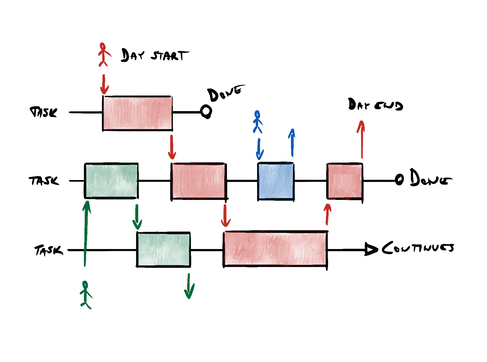

I have never before the year 2020 worked fully remotely with a team. Earlier experience was from working alone and only had occasional meetings with others - that’s easy and only thing you need to worry is getting lonely. Now I work with a team on things that require collaboration, so it’s much harder - you can’t just mimic the co-located way of working remotely. Or you can, but it’s suboptimal and leads into inefficiencies. By GitLab terms that stage of remote is called [skeuomorph](https://about.gitlab.com/company/culture/all-remote/phases-of-remote-adaptation/).

I went through the [GitLab Leading remote teams Coursera course](https://www.coursera.org/learn/remote-team-management) and I feel it gave me some fresh ideas on how to approach working fully remotely. 

Most of my work experience is from working in an traditional agile way; co-located, collaborating, discussing directly with the people who are needed to solve the task at hand, immediately when the need arises: Going through the difficulties with a whiteboard, having retrospectives with post-it notes, etc.  

> In short, high-bandwidth discussions with people in real time. I’ve learnt to think that’s the most efficient way. 

Somehow, that doesn’t seem to be working so well in remote world.

Now people are more easily blocked because coworkers are absent, and some information is missing. Problem solving is harder when you need to collaborate via video meetings. Tools like Miro are great, but you are not allowed to always use them.  

You also get tired being in a video meeting (we also have a new term, [Zoom Fatigue](https://ideas.ted.com/zoom-fatigue-is-real-heres-why-video-calls-are-so-draining/)) the whole time (and you are probably the only one with the camera on). You have the freedom to be how you like, because you are at home, but somehow you still are more than ever attached to your work laptop and a headset, because that’s the only link to your team mates. You don’t need to commute, but you are doing more hours and get less stuff done.

At least that’ my feeling of the year 2020, and I’d like to change that. 

In the Leading Remote Teams course they suggest **asynchronous workflows**, **low context communication**, **iteration**, **asynchronous communication instead of synchronous meetings** and pedantic **documentation** as means to make remote work more efficient. Following is a bit more detailed listing on the contents of the course. I don’t necessarily agree with everything nor have tried if they work in practice, but for sure there was a lot of thought provoking content.

# Work in a remote-first company
Work in a remote-first way has different requirements, and thus also different success factors than traditional co-located, or mostly office way of working. At GitLab they have concluded that it’s important to 

* Emphasise asynchronicity and non-linear workdays
* Use low context communication
* Iterate
* Avoid synchronous meetings (and then make the most of them)
* Document everything 

## Asynchronicity and low context communication
GitLab is advocating for asynchronous workflows, nonlinear workdays and low context communication. From the traditional agile co-located point of view these are interesting, because **they slow down the communication and work cycle times**, which are usually seen as a bad thing. 

But remote work has different requirements than co-located working, so it makes sense to divide work so that it’s detached from blockers and can be done asynchronously. The idea is that can be working on different topics on your own, and if you face a blocker, you use low context communication to pass the work item forward, or ask for input. Context switch is a smaller problem than being blocked.

> **Low context communication** means that you don’t assume others to know anything about the topic, but write down everything that is needed to answer the question or continue the work. 

The next person might see your message in the next day or even later, and it would cause a lot of waste if they’d need to ask some additional questions before they can continue the work, or answer your question.

In order for this to work, **you should not evaluate people by the speed they respond to messages**. They might have a different work schedule than you, and could be starting their day much later, or earlier, or have some time off in between. They probably limit the time they are reading and reacting to messages to have time to concentrate.

That’s why you need to plan for the asynchronicity in your communication and working.

What this seems to be meaning is, that instead of concentrating on speeding up the cycle times, you need to make work tasks independent and detached from blockers. That allows people to work on them independently. This also means that they might be proceeding with multiple threads at the same time, switching from task to task when they get to a point they get finished or blocked. This sounds a bit like a flash from the past by maximising the utilisation, but then again we’ll need to remember that it’s different to work when everyone is working remotely. Switching context from one task to other is not as much of a problem than being blocked because others aren’t there to help you.

## Progress over perfection: Iterate 
Asynchronous workflow slows down the communication and cycle time, and concentrating on iterations is important: **progress over perfection**. You should iterate and share work that is  in a draft state. 

This means that you should be publishing work that makes you feel a bit bad, because the work has not been perfected. It’s more important to get the work out and get feedback and other people involved. 

Making solid progress in small iterations allows you to progress faster in the end.

This aligns well with my earlier mindset: I’ve always liked the idea of iterating on things. Getting something visible done, and then proceeding with that.

## Prefer asynchronous communications and reserve synchronous meeting for important matters or 1:1 meetings
Meetings are expensive and hard to arrange: **meetings require people to be at work synchronously at the same time**. There are connection and software problems, and their life at home might mean they are unable to concentrate at that precise moment. 

Therefore meetings should be minimised and low context asynchronous communication should be preferred instead. People are encouraged to propose an asynchronous communication instead of a meeting, if they think it could solve the matter.

If you have a meeting, you should maximise the benefits and everyones input. This can be achieved by lengthening the time span of meeting with agenda documentation.

## Meeting agenda spans the meeting to include those who can not attend

If you need to have a meeting, always have a clear agenda. Agenda should be posted beforehand so people can 
* Review it and prepare for the meeting
* Ask questions and give input
* Decide if they need to attend
* Propose to cancel the meeting if they think the matter can be worked on asynchronously

Meeting agenda document should also be used during the meeting for making comprehensive notes on the meeting: It’s ok to concentrate on documentation. 

Meeting should also be recorded whenever possible, and even using some transcription service can be beneficial. 

The idea is to allow people who were not able to participate to watch the recording, and then use the meeting agenda document afterwards to give their input.

### Use synchronous communication where it matters the most
Remote work also increases feelings of loneliness and risk of burnout: Being always on burns out people, so they should be encouraged to also have time off. As said before, **people should not be valued on how quickly they respond to messages**. It's harder to detect how people are doing, so you should make effort to create a safe environment to bring up feelings of burnout. 

For example one on one meetings can be used for this, or other synchronous communication methods.

## Documentation
Slower communication in asynchronous works means that often it’s not feasible or desirable to ask things from other people in the team - it might slow everyone down, and you’d be blocked until they answer. 

This is why documentation and having a **single source of truth** is so essential in remote work: to remove blockers. 

Everyone should be encouraged to find information by themselves, and **discussion should be redirected to the single source of truth**. 

At GitLab they have the handbook in git, and process proposals vial merge requests: I really like this idea and it would be interesting to test it. Having changes as merge requests might make it easy for everyone to track the changes, and would create a natural setting to discuss the change, and further elaborate it.

Documentation is always hard and it’s difficult to convince people to use their limited time for it. Hopefully we are starting to find better ways to incorporate it to ways of working and also improve the experience of writing documentation. 

# Wrap up

I didn't go through the states a company transitioning to remote work go through (or could go according to GitLab), but here they are:
* Skeumorph (imitating)
* Functional state (functional changes to promote remote work)
* Asynchronous state (work is being done independently)
* Intentionality (organization is built for remote)

All companies are not aiming to be intentionally built for remote work nor should they, but it's good to understand what elements they could take into use to make remote working more efficient, and in a sense move on a higher ladder in the transition as well.

Some of the tools proposed by GitLab are

* Emphasise asynchronicity and non-linear workdays
* Use low context communication
* Iterate
* Avoid synchronous meetings (and then make the most of them)
* Document everything 

My experience is that companies are more ofthen on the level of skeumorph or functional - you can do occasional remote work, but it's more imitating colocated work and making sure that the systems support remote connections etc. 

What's missing is enabling asynchronous workflows and non-linear workdays, and that's something I think people should be more considerable about. Especially during COVID-19 when people oftne need to attend to their children while working at home.

It remains to be seen how you can keep the collaborative aspect of work while you also enable asynchronous workflows and independent working. After all solving complex problems require real collaboration and not just working on different bits of a larger whole. In complex environment working on separate parts of the whole doesn't benefit the whole but instead damages it ([Organize for Complexity](https://www.researchgate.net/publication/275605232_Organize_for_Complexity_How_to_Get_Life_Back_Into_Work_to_Build_the_High-Performance_Organization)).

Meanwhile, going through the contents in Leading remote teams -course is not a waste of your time.