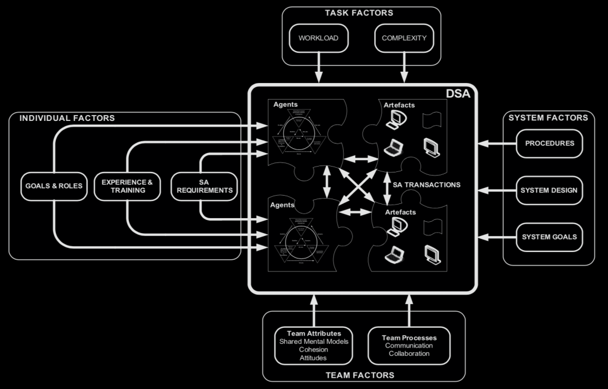
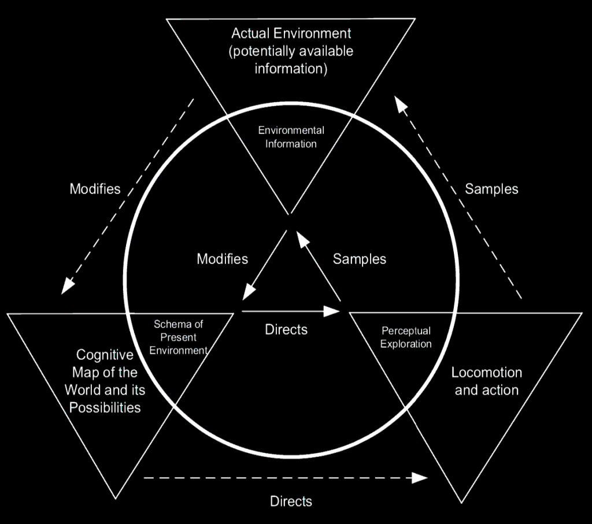

Distributed situation awareness (DSA) is model that takes a systemic view to situation awareness (SA). Stanton et al. have described their DSA model in an article “Distributed situation awareness in dynamic systems: theoretical development and application of an ergonomics methodology”, from year 2006 (Stanton et al. 2006). They propose that both human and non-human agents in the system each have their own situation awareness (at least by holding contextually relevant information) . Different agents have different goals and thus their SA may also be different, but compatible.

DSA analysis focuses on the interactions between agents, which may be verbal or non-verbal behavior, customs, etc. DSA also indicates that SA holds loosely coupled systems together and one agent may compensate for degradation in SA in another agent (Stanton et al 2006).

Following tenets define the theory (these are directly from an article by Stanton et al: State-of-science: situation awareness in individuals, teams and systems):

- Situation awareness is an emergent property of a sociotechnical system
- SA is distributed between human and non-human agents in the system
- Systems have a dynamic network of information and each operator have unique view to it
- SA is maintained via transactions in awareness between agents
- Effective performance requires agents to have compatible SA
- Schemata are in key role in SA transactions and compatibility
- DSA holds loosely coupled systems together
- An agent can compensate degradation of SA in another agent

Following image, which tries to bind different elements of DSA together, can be found from their book too:

DSA is an interesting approach to complex systems because it concentrates on deep understanding of the tasks in a system and on what information each agent needs in any specific time. Being able to identify these requirements would be highly beneficial for systems designers. It might also help to reduce the mental workload relating to perception and comprehension of the data in the system. Considering DSA, it may not be optimal to strain each operator in the system with all the available data.

In addition, it is beneficial to be able to study the system as a whole – concentrating on single operators gives a limited view on the situation and may fail to reveal problems on systems level.

DSA can also be scaled down to individual level, as it is based on a perceptual cycle model by Neisser (Neisser 1976).

Perceptual cycle model describes how human behavior is schema-driven. Diagram above shows how the schemata directs perception and actions, which in turn sample and change the world, which continually modifies the schemata (Salmon et al 2018).

I’ve been working with complex, distributed systems during my career and DSA is an interesting model for me. I like how it is based on schema theory and perceptual cycle model, and that it acknowledges that SA will hardly ever be exactly the same in two agents in the system, and that agents holding SA may or may not be humans.

The notion that also non-human agents hold SA may be a helpful view when working with advanced automation and artificial intelligence – AI agent is just another agent in the system, and needs to be considered as such.

## References

Stanton N. A, R. Stewart , D. Harris , R. J. Houghton , C. Baber , R. McMaster , P. Salmon , G. Hoyle , G. Walker , M. S. Young , M. Linsell , R. Dymott & D. Green (2006) Distributed situation awareness in dynamic systems: theoretical development and application of an ergonomics methodology, Ergonomics, 49:12-13, 1288-1311, DOI: 10.1080/00140130600612762

Salmon, P.M., N.A. Stanton, G.H. Walker, and D.P. Jenkins. 2009. Distributed Situation Awareness: Theory, Measurement and Application to Teamwork. Ashgate: Aldershot.

Stanton, N. A., Salmon, P. M., Walker, G. H., Salas, E., & Hancock, P. A. (2017). State-of-science: situation awareness in individuals, teams and systems. Ergonomics, 60(4), 449–466. https://doi.org/10.1080/00140139.2017.1278796

Salmon, Paul & Read, Gemma & Walker, Guy & Lenné, Michael & Stanton, Neville. (2018). Distributed Situation Awareness in Road Transport: Theory, Measurement, and Application to Intersection Design. 10.4324/9781315609256.