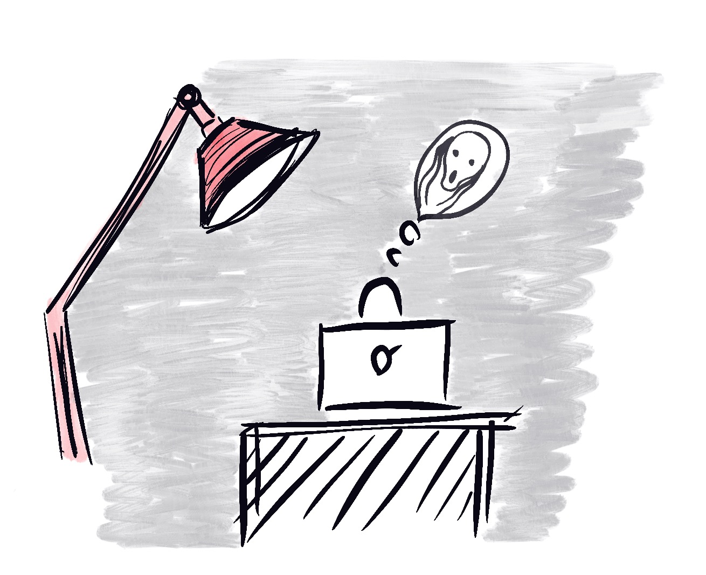
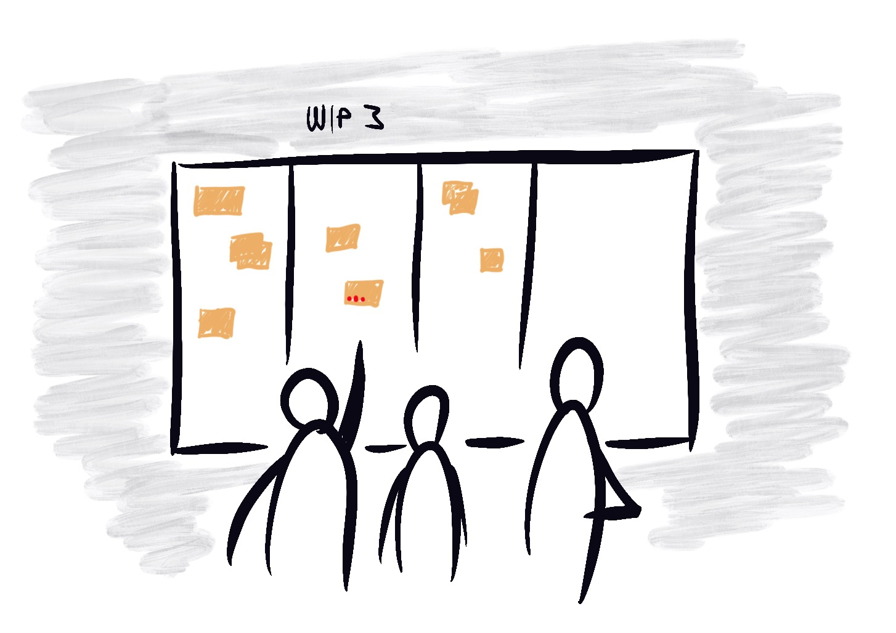

Creating software is complex, and we are all the time facing problems we are solving for the first time in our lives, possibly with the tools we haven't mastered yet. That can be a lot to bear and a source of anxiety. Kati Vilkki wrote [a good blog post on culture of fear](https://www.reaktor.com/blog/facing-up-to-a-culture-of-fear/), which inspired me to think about the subject from my perspective, on team and single developer level.

Fear consumes energy, hinders our cognitive functions and may make us withdraw from other people. It can also increase stress, and prolonged stress can, for example, make us less creative and thus hinder our problem-solving skills. Many of these effects are interconnected and can lead to a negatively affecting reinforcing cycle. Stress and fear may distance you from colleagues which is exactly the opposite of what you should probably be doing.

Everything depends on the context: What is causing the fear, who are there to face it with you, and where it happens. Kati lists multiple sources of fear, and I want to concentrate on the following (listing from Kati’s writing):

* Loss of status
* Loss of appreciation
* Loss of identity
* Loss of work

I have never been in a workplace where I would have needed to fear being treated badly, like being yelled at or threatened to kick me out. Instead, I have often felt I’m not good enough or that I should be doing better. 

I’m talking about the situation in which you feel you should manage by yourself, so you don’t ask for help. The longer you struggle alone the harder it’s to ask for help, because then others would know how much time you have wasted without results. I can admit I’m guilty of this and based on discussions with others (that have worked on the field for over 10 years), I’m not alone. 

Some kind of nerd pride is connected to programming so that admitting you don’t know something is linked to your very being as a developer and raises the fear of losing your status or identity. Even if you know how to finish the task, it often feels like you should have done it faster. Others would have, or so you’d think.

## Creating Software Is Hard

Creating software is hard. Admitting that there are a lot of uncertainties even in the simpler tasks helps people feel like they are trusted to get the work done, and if it takes some time, it’s because it’s hard, not because the person doing it is incompetent.

Impostor syndrome is common in IT field and means, that you think other people are much smarter than you are and you are just a fraud. A colleague once said he had gotten over with impostor syndrome after reading that it can result from you keeping yourself too important to admit others you don’t know something. That hit somewhat home for me too. Admitting that I don't know something is hard every single time. Especially if it's not directly asked, but I should proactively open my mouth.

By admitting that you need help you are creating an example for others in the team as well. As you probably know, psychological safety is a common feature in high performing teams ([according to studies made at Google](https://rework.withgoogle.com/blog/five-keys-to-a-successful-google-team/)). By showing that it’s ok to show weakness, you help to build a safe environment and it will help your team to grow to be a better environment for everyone.

## The Team is the Smallest Entity

The team should usually be the smallest acting entity in building software. So what could a team do to tackle the fear? David J. Anderson has listed some team practices in his [Kanban book](https://www.goodreads.com/book/show/8086552-kanban), which can help to make it easier to ask for help and collaborate. 

One option is to **agree on a practice that nobody in a team is allowed to wrestle on a blocker problem more than 30 minutes alone**. This can make it clear for everyone that asking for help is seen as a good thing and makes the team perform more efficiently. Everybody knows that you don’t only have permission to ask for help, it’s expected of you.

Another practice is to **track how long a task stays in the same phase** (column, when talking about Kanban). The easiest way to do this is to add a dot to it in each daily. This helps the team to focus on tasks that seem to be blocked and proactively offer for help. I must emphasize that this kind of practice should be agreed on as a team - otherwise this can also add the wrong kind of pressure for the team members. 

Each policy should be discussed and agreed as a team so that everybody knows what is the change you intend to achieve.

Kanban's way of **limiting work in progress** is also partly a way to encourage collaboration and to make sure nobody is left alone with problems.

I'd still keep in mind with all these, that people like to work differently. Some of us like to debug problems collaborately, but sometimes it's also good to be able to use some time alone to be able to concentrate and understand the problem on your own - that should still be possible too.

## Vulnerability

The best way to start is leading by example: Make it acceptable to ask for help and admit you don’t know how to proceed. Show others you are not afraid to be vulnerable and maybe they will follow.

Saturday night 12. April 2020. ”The quarantine stories”.