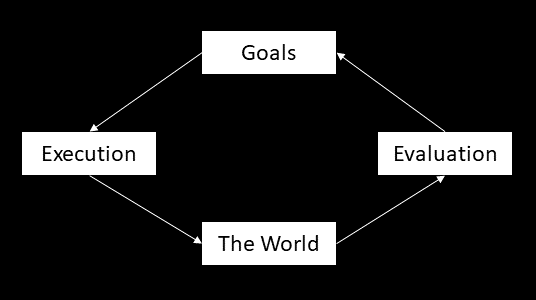
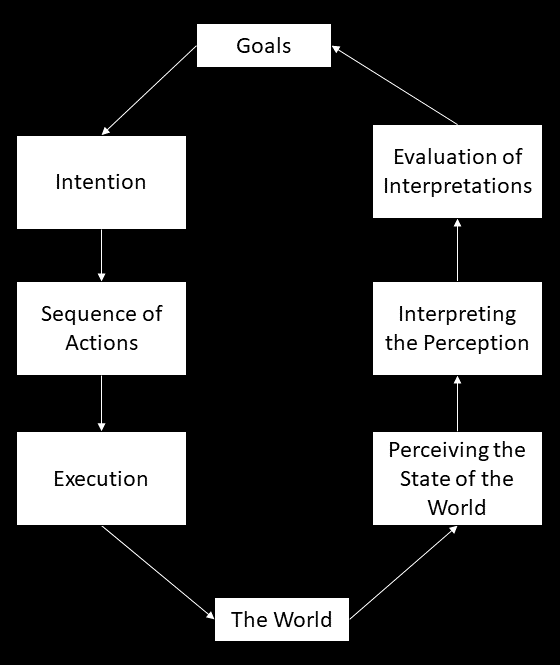

Creating usable software is not easy. You are blind to the usability problems of your user interface because you know how things work. You don’t need feedback in a way that other users of your system need. You don’t need the system to tell you what actions are available in each situation. If an action takes some time, you know what is happening(right?), but it must be told for the others!

When designing an user interface, it helps if you know something about how people act, that is, how they plan their actions and how they see and structure the world. It’s good to realize in the first place, that people’s behavior could better be described as situational than planned. They don’t always have a plan to follow; probably they don’t even know what is possible in the first place. You may also have a nice mental model of your softwares function in your head, but you should remember that other users probably never has the same model. They construct their own based on the things they see and actions they do and the feedback they receive.

## The Action Cycle

Donald A. Norman has one way to describe people’s behavior. He calls it The Seven Stages of Action (The Design of Everyday Things). The basic idea is simple and consists of four things. Everything starts from goals, the objective to the action. Second thing is the world which is the target of all actions. Goals picture states in which the user would like to see the world. Two things are between the goals and the world: execution and evaluation. In execution the user makes actions for the world and then she evaluates the state of the world after the actions and compares it to the goals. This is called the action cycle.

As you can see, there is only three action related sections here and the model was called seven stages of action. Execution and evaluation can bot be divided to three subtasks.

## The seven stages of action.

Goals needs to be translated into intentions which are more specific executable and achievable statements of what is to be done. These intentions are then turned to sequence of actions that really result in achieving the intention. Finally, this sequence of actions is executed which changes the world.

After and while executing the actions, we perceive the world and get the sense of its state. By perceiving the world we get data which we need to translate into information. In other words, we try to interpret the perception, make sense of it. Finally we judge if the change in the world is what we wanted in the first place by evaluating the interpretations.

These stages form the model to explain how people do things. Problems in any of the stages makes the user feel uneasy and judge the software she is using. Or actually, makes her blame herself for she can’t use the program, another topic of the book. This model can be used to help you design and evaluate your user interface. It should be clear for the user what the software can do (goals) and how it does it (intentions). Possible actions should be available and understandable so the user may see what it takes to fulfill the intentions (sequence of actions). Interaction with the software should be intuitive and obvious, natural (execution).

The user has no idea what the system does in the background so all feedback is welcome (perceiving the state of the world). All informative feedback is welcome. Everything you give to the user should say something to her and be meaningful. Use internal logs for everything else to avoid confusion. If an action takes time, tell it to the user. If there is a problem, tell what’s wrong. If possible, tell the user what the program needs before it can finish. Based on the feedback, the user judges if the things she did was correct or not and it her goals was met (interpreting the perception and evaluating the interpretations). It’s not only what you show but how you do it also counts.

Remember that this is not a full theory of human behavior but rather a directional model to explain it. All the stages are not required for all action. The sequence of actions may be completely different in some situations. If you want to know more (and if you ever work with user interfaces, you should), start by reading the Design of Everyday Things.