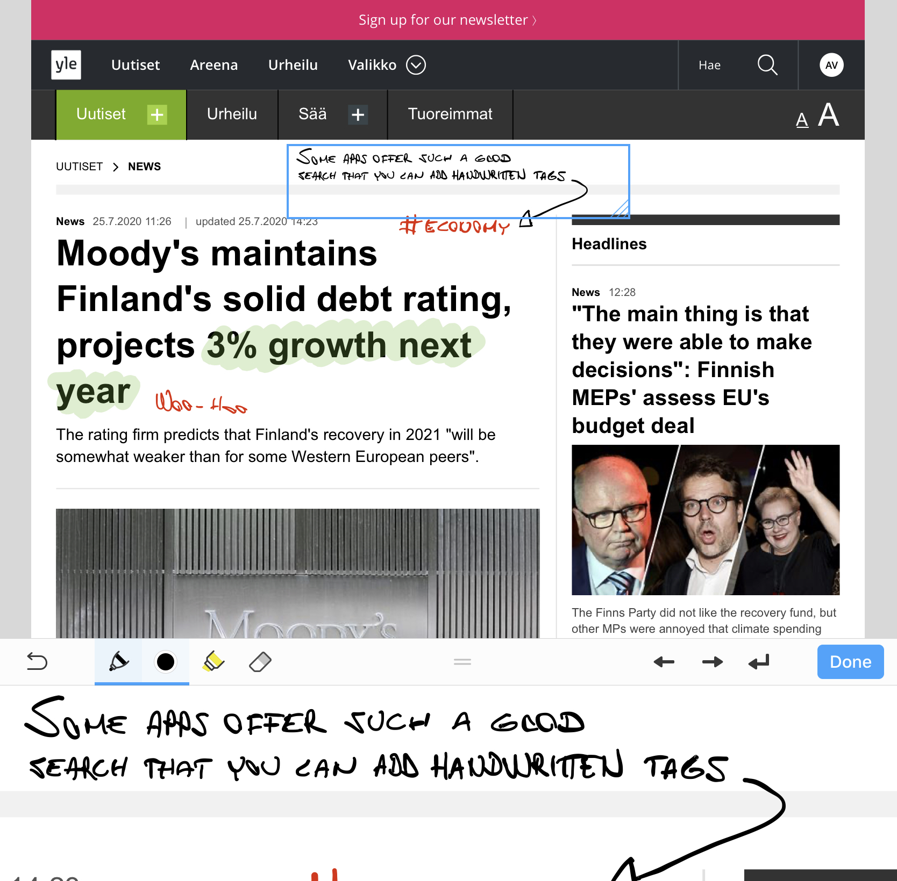
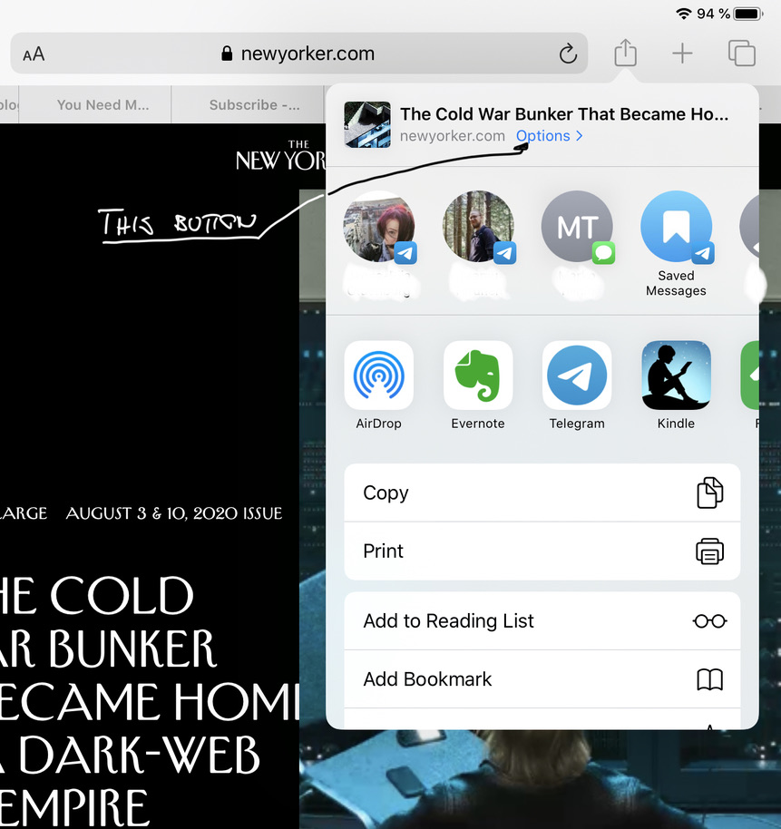
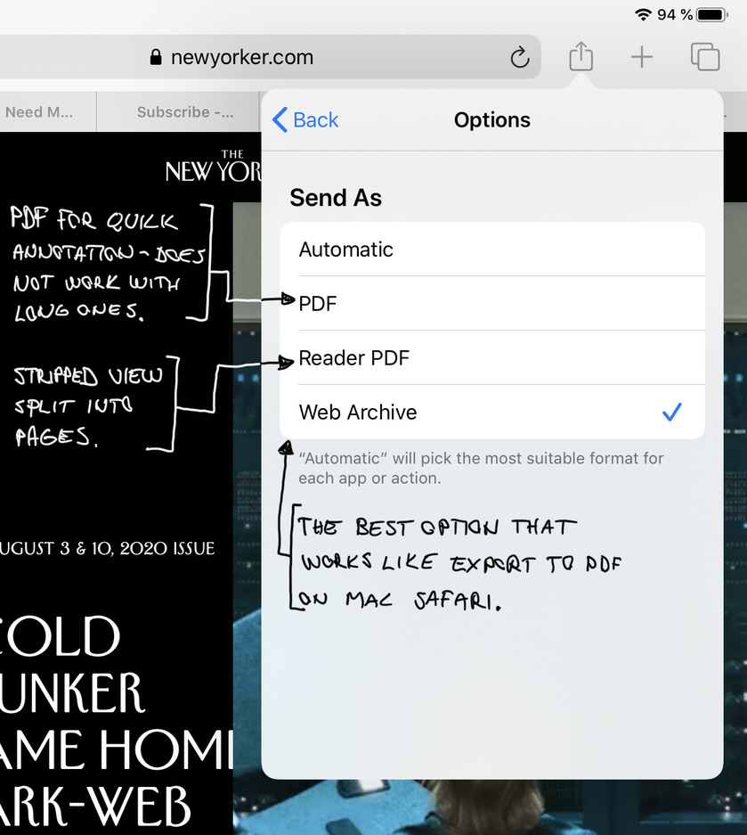
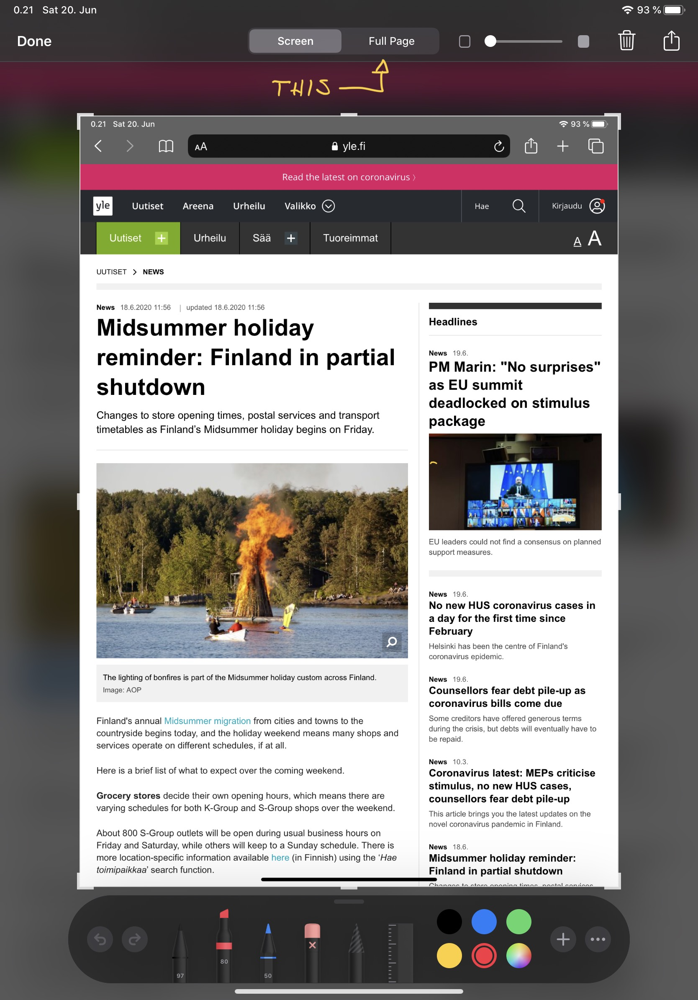
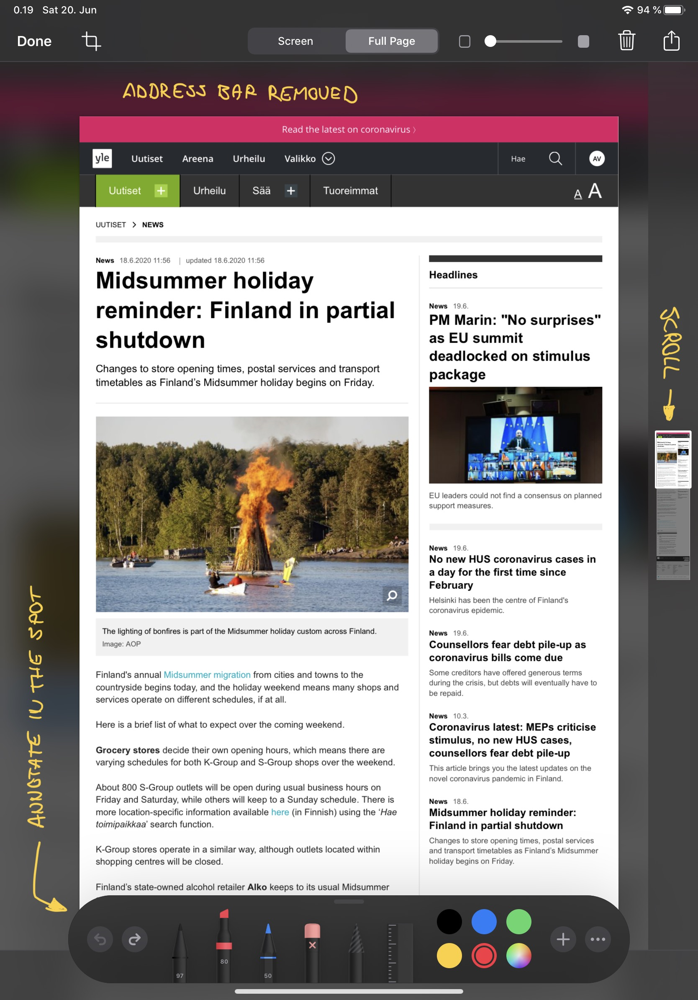

**Updates to this text**

* **11. April 2022** Nowadays I'm using [Reeder](https://reederapp.com) for both RSS and my read it later -needs. The application is beautiful on iOS, iPad OS and MacOS.

* **22. November 2020** My joy didn't last that long - Web Archibe feature was changed in the iOS14, or at least it looks like it. Now the website is saved in webarchive format instead of PDF. You can still get the PDF but it's divided to pages, which makes it less appealing to read. 

* **31. July 2020** At first I thought the only way to get a good PDF on iPad OS was to take the full page screenshot, but luckily there was also an option to create a **Web Archive** PDF in the sharing view. I changed the text to include this.

Original text:

Being in control is the best aspect of using PDF as a read it later service: you can modify how the website looks like, save it so that it’s yours to read, annotate and store however you like to. 

It’s not perfect, but it’s surprisingly good.

> styling makes reading the article more memorable compared to read-it-later services

PDF has been the best format to read books on iPad, which got me thinking that why not using it for reading web long reads as well. PDF works on every platform and can render the website as it is with all the fonts and visuals. It makes reading the article more memorable compared to read-it-later services like Instapaper and Pocket.

If you want to archive an article in a readable format, so that it can have styles of the source website and images, PDF is the best option I’ve found. iPad with an Apple Pencil has emphasized this more as now it’s **easy to annotate and doodle the file with the pencil** - while still being able to keep the file as a multi-platform PDF.

iPad also has enough power to render even the largest PDF files so that the experience is snappy - and using the Pencil is as useful as ever.

Apple ecosystem has amazing web to PDF features: 

- Safari browser on Mac OS can export the website (as it looks like in the browser) by File => Export as PDF
- iPad OS (or iOS) you can take a screenshot, and expand it to cover the full website so you can annotate right away, and then save as PDF
- iPad share to PDF has additional options to create an "archive" PDF that looks just like the website (no paging), which you can then annotate with whatever application.

It has been a while I’ve been this happy to find a new functionality from my devices:

Mac OS
[Crop or rotate a PDF in Preview on Mac - Apple Support](https://support.apple.com/guide/preview/crop-or-rotate-a-pdf-prvw11567/mac)

iPad OS (iOS)
[Take a screenshot or screen recording on iPhone - Apple Support](https://support.apple.com/guide/iphone/take-a-screenshot-or-screen-recording-iphc872c0115/ios)

I noticed that there seems to be a limit for a full-page screenshot on iPad OS. Sharing as a "Web Archive" seems to be working better. Print to PDF is another option, but I don't like the paged end result, that you can't control.

## Reading as it’s meant to

> If I’d be a person with a tendency to kitchen psychology, I’d say that reading articles so that they are more uniquely formatted and styled, leaves a bigger memory footprint.

### Visuals 

Using PDF you can read the article the way it was delivered. This can be both a negative and a positive aspect, but luckily websites are usually quite pleasant looking today (at least if you block the ads). I love the design of The New Yorker and enjoy reading the articles rendered as they have styled them.

I appreciate services like [Instapaper](https://www.instapaper.com/) and [Pocket](https://getpocket.com/), and if they work for you, they are great options (**pick Instapaper if you don’t need tagging or if you need notes, Pocket if you need tags and highlights are enough without notes**). These services can parse the content from the website and reflow them to be readable on any screen.

But... They make all the articles look the same as well. I was a bit surprised to notice it bothers me. Most of the websites I follow are beautiful, and seeing the visuals helps me keep in mind what I’m reading and from where, and probably also helps to remember the individual article as well. If I’d be a person with a tendency to kitchen psychology, I’d say that reading articles so that they are more uniquely formatted and styled, leaves a bigger memory footprint.

### Paid content
Some read it later services are not able to get the content behind a paywall, even if you have the subscription, or then you’d need to give your credentials to the service. Website to PDF doesn’t have that problem, you can export any website you can open in your browser.

### Archive
The most comforting idea of using PDF for long reads is that then they are already in an achievable format. I can dumb them to some cloud drive and forget there. Or maybe do some tagging and build a searchable database. I have the option, and I’m not depending on a single service that might go down - or more annoyingly would change their pricing model to be too aggressive.

## Concerns

**PDF files can take a lot of space**, like one longer article can be 10Mb. It remains to be seen if it will cause some problems in the future. It isn’t too hard to export old ones to a cloud drive, so I think it will be ok. 

**The screenshot way of creating the PDF removes links**, unfortunately. It can still extract the text though, but it's better to use sharing as the Web Archive.

> If you read a lot with a phone, read-it-later services might be a better option.

If you use Mac and iPad, you should not have any problems with the **resolution** of the displays. You might want to make sure that the width of your browser is practical when you do the export. Most websites are responsive as well, so you can try what is the optimal width for each. Reading those PDFs with iPhone is not optimal, and if you do the capture with the iPhone, it’s not optimal for other larger devices. The landscape is your friend here, and to me, this is not such a big issue. If you read a lot with a phone, read-it-later services might be a better option.

**PDF’n very long websites might not be practical.** I tend to trim the PDF a bit in Preview (using Mac), but if the PDF is too long, cropping doesn’t work. Export to PDF and full-page screenshot creates a PDF file that is a one very long page - printing to PDF might be a better solution for very long texts. 

The full-page screenshot also has a limit after which it just cuts the page, but using the share view with "Web Archive" seems to be working better.

One important feature in a read it-later-app is to remember the progress in each story. Because the PDF is one long single page, some applications are not able to **remember the location** you are at when you close the file and reopen it. Notability is one that does remember. GoodNotes remembers if you don’t close the file. PDF Expert seems to be working ok so that you can have the PDF files in the cloud (it has failed occasionally though).

## Apps for reading and annotating the PDF files

Using a dedicated note-taking app means a better user experience, but then you can’t keep the files as PDFs in the cloud. Usually, notetaking apps support exporting to PDF so this might not be a dealbreaker - but it's an annoyance and an extra step in the process, and can be a pain if you need to access the files on different devices.

Just because of the better user experience, if you don’t need to have your articles as PDF all the time, I’d recommend Notability or GoodNotes.

Some of the apps are excellent at transforming handwritten notes to texts: This means you can for example **add handwritten tags** to the files which then will be indexed. GoodNotes excels at this.

### Notability

Notability is an excellent notetaking and PDF reading app. The only caveat is that you need to import the PDF to the application, so you can’t have them on iCloud as PDFs or whatever it’s you are using. You can export them from the app though, and you can also create an automatic backup as PDF to your chosen cloud, so that might be a good compromise.

Mac app for Notability is missing features compared to the iPad app, which is disappointing.

### PDF Expert

PDF Expert might be the most promising app for the job. The reason is that it’s able to use the PDFs directly from the cloud and they can stay as PDF. The UI is also quite nice because you can hide all the toolbars when you are reading (this should be a mandatory feature for all apps - one tap hides the toolbars, another brings them back, and there is a nod for the scrollbar always visible). 

The notetaking experience is not as good as with Notability and GoodNotes, and I have had some concerns with saving files - at some point, it felt like the app didn’t always automatically save to the cloud. 

Managing the files in iCloud is also a bit of a hassle (I have a todo-folder, and after reading I move the file to another folder: I can’t do it by having the file open and I need to go to another view to do the move).

### GoodNotes

GoodNotes would be a great option otherwise, but it has one annoying problem: It doesn’t remember the reading position if you are reading a long single-page PDF file. Notetaking experience is best in the class and organization is better than with Notability. 

Similar to Notability, you’ll need to import PDF files to the app, but they also have a good desktop app so it might be a full solution.

### Apple Books

[Books can also be used to read & annotate PDF files.](https://support.apple.com/en-au/HT205751) I have not been using it like that and found the feature by accident, but it might be a low-cost option. Disappointedly it remembers the reading progress on the page level, so reading those one-pagers that Safari produces is not optimal. I wish I had a direct way to give feedback to developers...

# Seems promising this far

I've been using PDF for reading long web stories about a month now and it seems to be a good way to read articles I find by using a RSS reader. I tend to collect more to the reading queue than I'm able to read, but that happens with any service. I have an app idea that would make this process much more flowing, but I just don't have the time (or knowledge) to implement that now.

