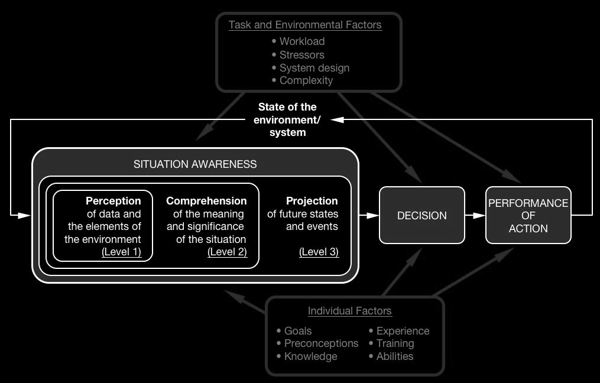

Situation awareness (SA) is an interesting concept to consider in software design. The term comes from human factors research and was at first made popular by [Mica R. Endsley](https://www.researchgate.net/profile/Mica_Endsley), one of the most cited SA researchers.

Stanton et al. have published a really nice [state-of-science article](https://www.tandfonline.com/doi/full/10.1080/00140139.2017.1278796) on situation awareness. Situation awareness could be described as “knowing what is going around you”, and it can be regarded on individual, team or systems level (Stanton et al 2017). SA has become an important concept and there are also many formal definitions for it. One of the most commonly used and cited is from 1988 by Endsley:

> …perception of the elements in the environment within a volume of time and space, the comprehension of their meaning and a projection of their status in the near future.
> Definition of SA by Endsley (Endsley 1988)

The fastest way to understand the concept of SA by Endsley is to study this diagram, which is from Wikipedia (the diagram itself is by Endsley, this version is just a combination of multiple different instances).

Endsley’s model contains three levels: perception (Level1), comprehension (Level 2) and projection (Level 3), which together form the situation awareness (Endsley 1988).

One needs to understand the situation before making decisions, so SA is the precondition for decisions, which leads to action, changing the state of the world and feeding feedback to the perception phase. Task and environment factors (like stressors, complexity and interface design, automation, etc.) and individual factors (goals, experience, etc.) affect the process as well.

As was noted by Stanton, SA can be considered on three level: individual, team and system. Endsley’s model describes the SA on individual level. Many systems of today are networked and consist of multiple systems and operators, which hints it might not be sufficient to concentrate on individual operator SA. However in many situations it is a helpful model for user interface design, as it can be used to analyse what kind of information should be presented to a single operator.

Endsley has also defined a method to evaluate SA: SAGAT, or Situation Awareness Global Assessment Technique. SAGAT would be a topic of another writing, but basically it’s a freeze probe technique to measure SA in real-time situations. The situation is frozen and subjects are queried for their understanding of the situation at hand.

The need to freeze the situation means that the technique is most convenient in simulator environments, and naturally causing breaks to action can (and will) alter how people act and answer the questionnaires. It doesn’t mean that the technique is bad or invalid, but it limits its usability mainly to simulations or environments in which it’s ok to stop the action. Some special care needs to be given to the interpretation of the results as well.

The good thing is, that designers are able to evaluate their designs to make informed decisions on whether the SA requirements have been met or not.

Situation awareness is an interesting concept and can be helpful when designing interfaces for single operators, by enabling designers to think what kind of data operators should be at their disposal at any given task.

If you are interested in situation awareness in collaborative environments, check [Distributed Situation Awareness (DSA)](/writings/distributed-situation-awareness-dsa).

## References

https://www.researchgate.net/profile/Mica_Endsley

Endsley, M.R.. (1988). Situation global assessment technique (SAGAT). Situation Awareness Global Assessment Technique (SAGAT). 3. 789 – 795 vol.3. 10.1109/NAECON.1988.195097.

Stanton, N. A., Salmon, P. M., Walker, G. H., Salas, E., & Hancock, P. A. (2017). State-of-science: situation awareness in individuals, teams and systems. Ergonomics, 60(4), 449–466. https://doi.org/10.1080/00140139.2017.1278796
